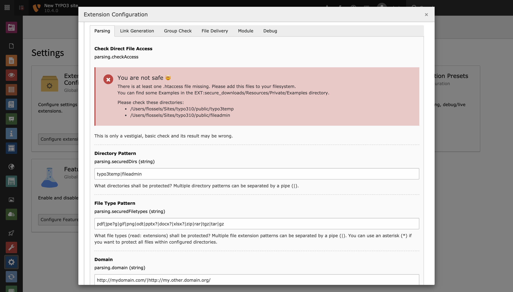

.. include:: ../../Includes.txt

.. _admin-extensionConfiguration:

=======================
Extension Configuration
=======================

All configuration is made in the "Extension Configuration" section of the "Settings" module beneath the "Admin Tools".

   The extension configuration can be found in the admin tools.

Properties
==========

.. container:: ts-properties

   ==================================== ==================================== ==================
   Property                             Tab                                  Type
   ==================================== ==================================== ==================
   securedDirs_                         Parsing                              string
   securedFiletypes_                    Parsing                              string
   domain_ (legacy)                     Parsing                              string
   linkPrefix_                          Link Generation                      string
   tokenPrefix_                         Link Generation                      string
   cachetimeadd_                        Link Generation                      positive integer
   documentRootPath_                    Link Generation                      string
   enableGroupCheck_                    Group Check                          boolean
   groupCheckDirs_                      Group Check                          string
   excludeGroups_                       Group Check                          string
   strictGroupCheck_                    Group Check                          boolean
   outputFunction_                      File Delivery                        options
   outputChunkSize_ (legacy)            File Delivery                        positive integer
   protectedPath_                       File Delivery                        string
   forcedownload_                       File Delivery                        boolean
   forcedownloadtype_                   File Delivery                        string
   additionalMimeTypes_ (legacy)        File Delivery                        string
   log_                                 Module                               boolean
   debug_ (legacy)                      Debug                                options
   ==================================== ==================================== ==================

.. ### BEGIN~OF~TABLE ###

.. _admin-extensionConfiguration-securedDirs:

securedDirs
-----------
.. container:: table-row

   Property
         securedDirs
   Data type
         string
   Default
         :code:`typo3temp|fileadmin`
   Description
         List of directories of your TYPO3 Server in that files should be secured, separated by pipe (|). Files in subdirectories
         will also be secured.
         You can use :ref:`regular expressions <admin-regularExpressions>` for this option.

.. _admin-extensionConfiguration-securedFileTypes:

securedFiletypes
----------------
.. container:: table-row

   Property
         securedFiletypes
   Data type
         string
   Default
         :code:`pdf|jpe?g|gif|png|odt|pptx?|docx?|xlsx?|zip|rar|tgz|tar|gz`
   Description
         List of file types (file extensions) that should be protected. Multiple file extension patterns can be separated by a
         pipe (|). You can use an asterisk (*) if you want to protect all files within configured directories.
         You can use :ref:`regular expressions <admin-regularExpressions>` for this option.

.. _admin-extensionConfiguration-domain:

domain
------
.. container:: table-row

   Property
         domain
   Data type
         string
   Default
         :code:`http://mydomain.com/|http://my.other.domain.org/`
   Description
         This is only required for absolute file links to your local server, e.g. :code:`https://example.com//fileadmin/image.jpg`.
         Not needed for internal (relative) links. Please note, that this configuration property is deprecated. Parsing the HTML
         output will no longer work with version 5. You should consider to use the TYPO3 API instead.
         You can use :ref:`regular expressions <admin-regularExpressions>` for this option.

.. _admin-extensionConfiguration-linkPrefix:

linkPrefix
----------
.. container:: table-row

   Property
         linkPrefix
   Data type
         string
   Default
         :code:`securedl`
   Description
         Prefix for generated links (the `"securedl"` part in "https://example.com/securedl/sdl-[JWT]/image.png").

.. _admin-extensionConfiguration-tokenPrefix:

tokenPrefix
-----------
.. container:: table-row

   Property
         linkPrefix
   Data type
         string
   Default
         :code:`sdl-`
   Description
         Prefix for generated token (the `"sdl-"` part in "https://example.com/securedl/sdl-[JWT]/image.png").

.. _admin-extensionConfiguration-cacheTimeAdd:

cachetimeadd
------------
.. container:: table-row

   Property
         cachetimeadd
   Data type
         positive integer
   Default
         :code:`3600`
   Description
         The secure link is only valid for a limited time, which is calculated from the cache time that is used for the page that
         carries the link plus this value (in seconds).

.. _admin-extensionConfiguration-documentRootPath:

documentRootPath
----------------
.. container:: table-row

   Property
         documentRootPath
   Data type
         string
   Default
         :code:`/`
   Description
         Do only change this configuration option, if your TYPO3 instance is running in a subfolder or you are using a SSL
         reverse proxy to map TYPO3 into a virtual subfolder. This configuration must start and end with a slash
         (e.g. "/proxy-typo3/").

.. _admin-extensionConfiguration-enableGroupCheck:

enableGroupCheck
----------------
.. container:: table-row

   Property
         enableGroupCheck
   Data type
         boolean
   Default
         :code:`false`
   Description
         Allows forwarding a secure download link to others, who can access that file if they have at least one front-end user
         group in common. Enabling this makes the checks *less* restrictive!

.. _admin-extensionConfiguration-groupCheckDirs:

groupCheckDirs
--------------
.. container:: table-row

   Property
         groupCheckDirs
   Data type
         string
   Default
         unset
   Description
         A list of directories for the less restrictive group check, separated by a pipe (|). Leave empty if you want to enable
         the group check for all directories.
         You can use :ref:`regular expressions <admin-regularExpressions>` for this option.

.. _admin-extensionConfiguration-excludeGroups:

excludeGroups
-------------
.. container:: table-row

   Property
         excludeGroups
   Data type
         string
   Default
         :code:`-1,0`
   Description
         A comma separated list of groups that are excluded from the group check feature (if enabled).

.. _admin-extensionConfiguration-strictGroupCheck:

strictGroupCheck
----------------
.. container:: table-row

   Property
         strictGroupCheck
   Data type
         boolean
   Default
         :code:`false`
   Description
         If enabled, files are only delivered if the user groups exactly match those of the secured link.

.. _admin-extensionConfiguration-outputFunction:

outputFunction
--------------
.. container:: table-row

   Property
         outputFunction
   Data type
         options
   Default
         :code:`stream`
   Description
         Due to possible restrictions in php and php settings, you probably need to adjust this value. By default "readfile" is
         used to deliver the file. If this function is disabled in your php settings, you can try "fpassthru". If you have
         problems with php `memory_limit` and big files to download, you need to set this to "stream", which delivers
         the files in small portions. The options "readfile_chunked", "readfile" and "fpassthru" are deprecated and will be
         removed in version 5. You should consider to use "stream" as output function.
         For nginx web servers, there is also the possibility to deliver the file directly from the server by setting this
         property to "x-accel-redirect".

.. _admin-extensionConfiguration-protectedPath:

protectedPath
-------------
.. container:: table-row

   Property
         protectedPath
   Data type
         string
   Default
         unset
   Description
         Only applicable if you use x-accel-redirect (see: outputFunction_). Specify the protected path used in your nginx
         location directive. A matching nginx `location` directive needs to be added.
   Example
         ::

            location /internal {
                internal;
                alias /path/to/your/protected/storage;
            }

.. _admin-extensionConfiguration-outputChunkSize:

outputChunkSize
---------------
.. container:: table-row

   Property
         outputChunkSize
   Data type
         positive integer
   Default
         :code:`1048576`
   Description
         Only applicable if you use "readfile_chunked" or "stream" as output function (see: outputFunction_). Specify the number
         of bytes, served as one chunk when delivering the file. Choosing this value too low is a performance killer. Please note,
         that this property is deprecated and will be removed in version 5.

.. _admin-extensionConfiguration-forcedownload:

forcedownload
-------------
.. container:: table-row

   Property
         forcedownload
   Data type
         boolean
   Default
         :code:`false`
   Description
         If this is checked some file types are forced to be downloaded (see: forcedownloadtype_) in contrast of being embedded
         in the browser window.

.. _admin-extensionConfiguration-forcedownloadtype:

forcedownloadtype
-----------------
.. container:: table-row

   Property
         forcedownloadtype
   Data type
         string
   Default
         :code:`odt|pptx?|docx?|xlsx?|zip|rar|tgz|tar|gz`
   Description
         A list of file types that should not be opened inline in a browser, separated by a pipe. Only used if "forcedownload"
         (see: forcedownload_) is enabled. You can use an asterisk (*) if you want to force download for all file types.
         You can use :ref:`regular expressions <admin-regularExpressions>` for this option.

.. _admin-extensionConfiguration-additionalMimeTypes:

additionalMimeTypes
-------------------
.. container:: table-row

   Property
         additionalMimeTypes
   Data type
         string
   Default
         :code:`txt|text/plain,html|text/html`
   Description
         Comma separated list of additional MIME types (file extension / mime type pairs, in which file extension and MIME type
         is separated by a pipe symbol). Can be used to override existing MIME type settings of the extension as well. Please
         note, that this property is deprecated and will be removed in version 5. You should extend the globals
         :php:`$GLOBALS['TYPO3_CONF_VARS']['SYS']['FileInfo']['fileExtensionToMimeType']` array.

.. _admin-extensionConfiguration-log:

log
---
.. container:: table-row

   Property
         log
   Data type
         boolean
   Default
         :code:`false`
   Description
         Each file access will be logged to database, this could be a performance issue, if you have a high traffic site. If you
         decide to turn it on, a backend module will be activated to see the traffic caused by user/ file

.. _admin-extensionConfiguration-debug:

debug
-----
.. container:: table-row

   Property
         debug
   Data type
         options
   Default
         :code:`0`
   Description
         For developing only. Please note, that this property is deprecated and will be removed in version 5.

.. ### END~OF~TABLE ###
