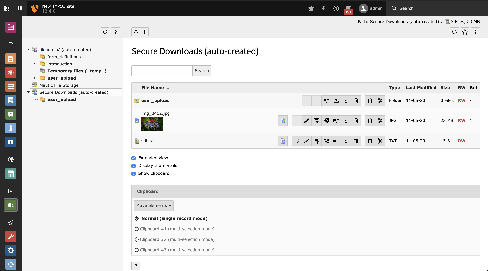

.. include:: ../Includes.txt

.. _admin:

==================
For Administrators
==================

This chapter describes how to install and how to configure this extension within the settings module of your TYPO3 instance.

.. important::
   This extension cannot secure links to files that you include in CSS, PDF, ... files.

.. _admin-installation:

Installation
============
There are several ways to require and install this extension. We recommend getting this extension via
`composer <https://getcomposer.org/>`__.

.. _admin-installation-viaComposer:

Via Composer
------------
If your TYPO3 instance is running in composer mode, you can simply require the extension by running:

.. code-block:: bash

   composer req leuchtfeuer/secure-downloads:>=5.0

.. _admin-installation-viaExtensionManager:

Via Extension Manager
---------------------
Open the extension manager module of your TYPO3 instance and select "Get Extensions" in the select menu above the upload button.
There you can search for `secure_downlaods` and simply install the extension. Please make sure you are using the latest version
of the extension by updating the extension list before installing the Secure Downloads extension.

.. _admin-installation-viaZipFile:

Via ZIP File
------------
You need to download the Secure Downloads extension from the
`TYPO3 Extension Repository <https://extensions.typo3.org/extension/secure_downloads/>`__ and upload the ZIP file to the extension
manager of your TYPO3 instance and activate the extension afterwards.
You can also download an archive from `GitHub <https://github.com/Leuchtfeuer/typo3-secure-downloads/releases/latest>`__ and put
its content directly into the `typo3conf/ext` directory of your TYPO3 instance. But please keep in mind, that the name of the
folder must be `secure_downloads` (the repository name will be default).

.. _admin-bestPractices:

Best Practices
==============
You can configure this extension to fit your specific needs. However, here are some "best practices" that may help you when first
using Secure Downloads:

* Install this extension as described above
* Enable the :ref:`create file storage <admin-extensionConfiguration-createFileStorage>` option
* Put your files into that storage

If you need to secure files outside of that directory, you still can adapt the :ref:`admin-extensionConfiguration-securedDirs` and
:ref:`admin-extensionConfiguration-securedFileTypes` options.

   All files of the newly create "Secure Downloads" file storage are protected by default.

.. _admin-accessConfiguration:

Access Configuration
====================

You need to secure all the directories and file types by your server configuration. This can be done with `.htaccess` files.
You find some example `.htaccess` files below and in the
`Resources/Private/Examples <https://github.com/Leuchtfeuer/typo3-secure-downloads/tree/master/Resources/Private/Examples>`__
directory of this extension.

Furthermore, you find a working nginx.conf file for ddev boxes in the same directory.

.. _admin-accessConfiguration-exampleConfiguration:

Example Configuration
---------------------
Please make sure to adapt the file match pattern as configured in :ref:`admin-extensionConfiguration-securedFiletypes`.

..  code-block:: apache
    :caption: .htaccess deny

   # Apache 2.4
   <IfModule mod_authz_core.c>
     <FilesMatch "\.([pP][dD][fF]|[jJ][pP][eE]?[gG]|[gG][iI][fF]|[pP][nN][gG]|[oO][dD][tT]|[pP][pP][tT][xX]?|[dD][oO][cC][xX]?|[xX][lL][sS][xX]?|[zZ][iI][pP]|[rR][aA][rR]|[tT][gG][zZ]|[tT][aA][rR]|[gG][zZ])$">
       Require all denied
     </FilesMatch>
   </IfModule>

   # Apache 2.2
   <IfModule !mod_authz_core.c>
     <FilesMatch "\.([pP][dD][fF]|[jJ][pP][eE]?[gG]|[gG][iI][fF]|[pP][nN][gG]|[oO][dD][tT]|[pP][pP][tT][xX]?|[dD][oO][cC][xX]?|[xX][lL][sS][xX]?|[zZ][iI][pP]|[rR][aA][rR]|[tT][gG][zZ]|[tT][aA][rR]|[gG][zZ])$">
       Order Allow,Deny
       Deny from all
     </FilesMatch>
   </IfModule>

..  code-block:: apache
    :caption: .htaccess allow

   # Apache 2.4
   <IfModule mod_authz_core.c>
     <FilesMatch "\.([pP][dD][fF]|[jJ][pP][eE]?[gG]|[gG][iI][fF]|[pP][nN][gG]|[oO][dD][tT]|[pP][pP][tT][xX]?|[dD][oO][cC][xX]?|[xX][lL][sS][xX]?|[zZ][iI][pP]|[rR][aA][rR]|[tT][gG][zZ]|[tT][aA][rR]|[gG][zZ])$">
       Require all granted
     </FilesMatch>
   </IfModule>

   # Apache 2.2
   <IfModule !mod_authz_core.c>
     <FilesMatch "\.([pP][dD][fF]|[jJ][pP][eE]?[gG]|[gG][iI][fF]|[pP][nN][gG]|[oO][dD][tT]|[pP][pP][tT][xX]?|[dD][oO][cC][xX]?|[xX][lL][sS][xX]?|[zZ][iI][pP]|[rR][aA][rR]|[tT][gG][zZ]|[tT][aA][rR]|[gG][zZ])$">
       Order Deny,Allow
       Allow from all
     </FilesMatch>
   </IfModule>

..  code-block:: nginx
    :caption: nginx configuration

   # Deny specific files in secured folder
   location ~ fileadmin/secure/.*\.(?:[pP][dD][fF]|[jJ][pP][eE]?[gG]|[gG][iI][fF]|[pP][nN][gG]|[oO][dD][tT]|[pP][pP][tT][xX]?|[dD][oO][cC][xX]?|[xX][lL][sS][xX]?|[zZ][iI][pP]|[rR][aA][rR]|[tT][gG][zZ]|[tT][aA][rR]|[gG][zZ])$ {
     deny all;
   }

   # Alternative: deny all files in secured folder
   location ~ fileadmin/secure/
     deny all;
   }

   # Some nginx configurations try to process media files directly. The secured uri path must be excluded from this rule
   # Media: images, icons, video, audio, HTC
   location ~ ^(?:fileadmin/|uploads/|_assets/|sdl/).+\.(?:jpg|jpeg|gif|png|ico|cur|gz|svg|svgz|mp4|ogg|ogv|webm|webp|htc)$ {
     expires 1M;
     access_log off;
     add_header Cache-Control "public";
   }

.. toctree::
    :maxdepth: 3
    :hidden:

    ExtensionConfiguration/Index
    RegularExpressions/Index

