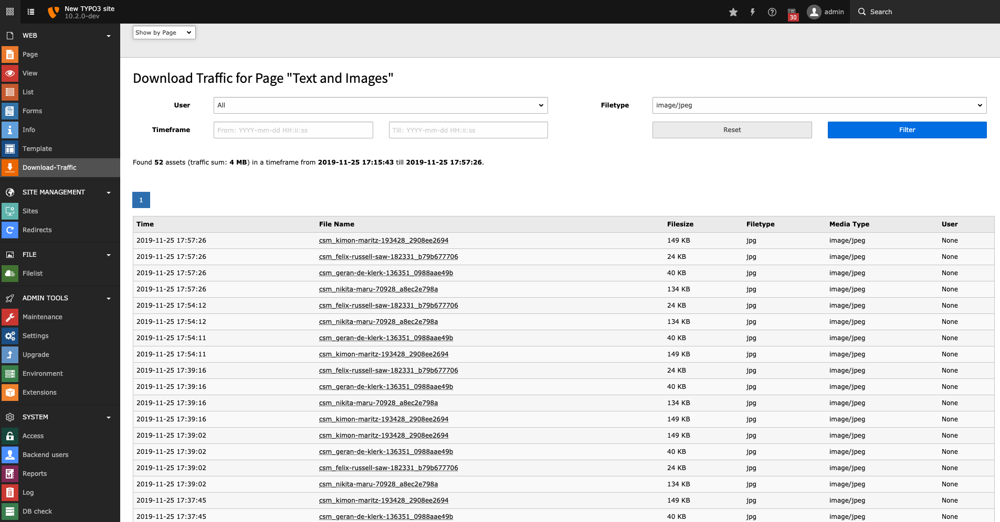
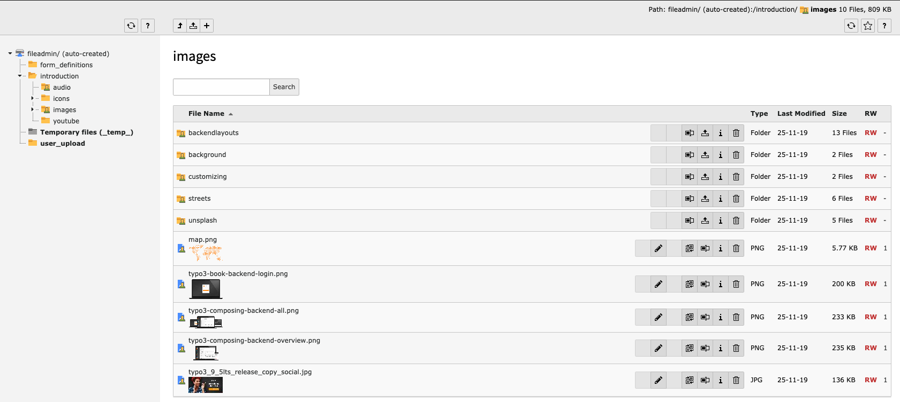

.. include:: ../Includes.txt

.. _editor:

==============
For Editors
==============

This extension comes with a backend module showing the access log to secured files. The module has to be enabled by setting the
:ref:`log <admin-extensionConfiguration-log>` to `true`.

.. _editor-backendModule:

Backend Module
==============

With the backend module you can show the summarized download traffic by a given time frame for all users or by a specific
frontend user. You can get an overview of all downloaded files or of downloaded files per page only.

The module must be enabled in the extension configuration.

    Example view of the backend module.

.. _editor-identifyProtectedFiles:

Identify protected files
========================

You can easily identify protected files in the file list, because all protected files and directories are marked with a dedicated
icon:

   Identify protected files within the "Filelist" module.

